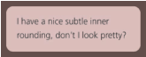
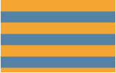
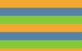
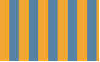

### 1.半透明边框
假设我们想给一个容器设置一层白色的背景和一道半透明白色的边框，body的背景会从它的半透明边框渗透上来。我们最开始的尝试可能是这样的：

	border:10px solid hsla(0,0%,100%,0.5);
	background: white;

并没有实现我们预期的效果。

默认情况下，背景会延伸到边框所在区域的下层。我们所做的事情并没有让body的背景从半透明白色边框处透上来，而是在半透明白色边框处透出了这个容器自己的纯白实色背景，这实际上得到的效果跟纯白实色的边框看起来完全一样。

解决方案：background-clip

	border:10px solid hsla(0,0%,100%,0.5);
	background: white;
	background-clip: padding-box;

----------

### 2.多重边框
#### box-shadow方案

	background: yellowgrenn;
	box-shadow: 0 0 0 10px #655,
				0 0 0 15px deeplink;

	background: yellowgrenn;
	box-shadow: 0 0 0 10px #655,
				0 0 0 15px deeplink,
				0 2px 5px 15px rgba(0,0,0,0.6);

注意：

1.投影的行为跟边框不完全一致，因为它不会影响布局，而且也不会受到box-sizing属性的影响。不过你还是可以通过内边距或外边距来额外模拟出边框所需要占据的空间。

2.他们不会响应鼠标事件，比如悬停或点击。如果这一点很重要，你可以给box-shadow属性加上inset关键字。

#### outline方案（描边）
	
	background: yellowgreen;
	border: 10px solid #655;
	outline: 5px solid deeplink;

另一个好处在于，你可以通过outline-offset属性来控制它跟元素边缘之间的距离，这个属性甚至可以接受负值，可以实现简单的缝边效果。

注意：

1.它只适用于双层“边框”的场景。
2.如果元素是圆角，他的描边可能还是直角。
3.描边可以不是矩形，请切记：最好在不同浏览器中完整地测试最终效果。

----------

### 3.灵活的背景定位
#### background-position的扩展语法方案
css3中的background-position属性得到扩展，它允许我们指定背景图片距离任意角的偏移量，只要我们在偏移量前面指定关键字。最后一步，我们还需要提供一个合适的回退方案。
	
	background:#58a url(code-pirate.png) bottom right no-repeat;
	background-position: right 20px bottom 10px;

#### background-origin方案
有一种情况极其常见，偏移量与容器的内边距一致。如果采用上面提到的background-position的扩展语法方案，是起作用的，但是代码不够DRY。

	padding: 10px;
	background:#58a url(code-pirate.png) bottom right no-repeat;
	background-origin: content-box;

#### calc()方案

	background:#58a url(code-pirate.png) bottom right no-repeat;
	background-position: calc(100%-20px) calc(100%-10px);

----------

### 4.边框内圆角

用两个元素可以实现这个效果，但如果我们只需要一个元素，有没有办法可以只用一个元素达成同样的效果呢。

#### 解决方案
	
I have a nice subtle inner rounding,don't I look pretty?

	
	

注意：阴影的扩张半径需要比描边的宽度值小，但它同时又要比(√2-1)r大(这里的r表示border-radius)。这意味着，如果描边的宽度比(√2-1)r小，那我们是不可能用这个方法达成该效果的。
（√2代表根号2，打不出来）

----------

### 5.条纹背景
#### 水平条纹

	
	width: 200px;
	height: 200px;
	background: linear-gradient(#f00 50%, yellow 0);
	background-size: 100% 30px;

	width: 200px;
	height: 200px;
	background: linear-gradient(#f00 33.3%, yellow 0, yellow 66.6%, yellowgreen 0);
	background-size: 100% 30px;

#### 垂直条纹

	width: 200px;
	height: 200px;
	background: linear-gradient(90deg, #f00 33.3%, yellow 0, yellow 66.6%, yellowgreen 0);
	background-size: 30px 100%;

#### 斜向条纹

----------

### 6.复杂的背景图案

----------

### 7.伪随机背景

----------

### 8.连续的图像边框

----------
