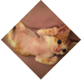
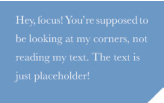
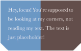
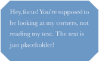
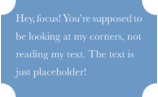

### 1.自适应的椭圆
#### 自适应的椭圆

	
	border-radius: 50%;

#### 上半椭圆

	border-radius: 50% 50% 0 0 /100% 100% 0 0;

#### 下半椭圆

	
	border-radius: 100% 0 0 100% /50%;

#### 四分之一圆

	border-radius: 100% 0 0 0;

----------

### 2.平行四边形

#### 嵌套元素方案

	<a href="#yolo" class="button">
	
Click me

	</a>

	.button { transform: skewX(-45deg); }
	.button > div { transform: skewX(45deg); }

#### 伪元素方案
	.btn1{
		position: relative;
	}
	.btn1:before{
		content: '';
		position: absolute;
		z-index: -1;
		top: 0; right: 0; bottom: 0; left: 0;
		transform: skew(45deg);
		background: #58a;
	}

----------

### 3.菱形图片

#### 基于变形的方案（用于正方形图片）
	

		
	

	.picture {
		width: 400px;
		transform: rotate(45deg);
		overflow: hidden;
	}
	.picture > img {
		width: 100%;
		transform: rotate(-45deg) scale(1.42);
	}

#### 裁切路径方案
	img{
		clip-path: polygon(50% 0, 100% 50%, 50% 100%, 0 50%);
	}

----------

### 4.切角效果
####  CSS 渐变

	
	background: #58a;
	background: linear-gradient(-45deg, transparent 15px, #58a 0);

	
	background: #58a;
	background:	linear-gradient(-45deg, transparent 15px, #58a 0) right,
				linear-gradient(45deg, transparent 15px, #655 0) left;
	background-size: 50% 100%;
	background-repeat: no-repeat;
	

方法1：

	background: #58a;
	background:	linear-gradient(135deg, transparent 15px, #58a 0) top left,
				linear-gradient(-135deg, transparent 15px, #58a 0) top right,
				linear-gradient(-45deg, transparent 15px, #58a 0) bottom right,
				linear-gradient(45deg, transparent 15px, #58a 0) bottom left;
	background-size: 50% 50%;
	background-repeat: no-repeat;

方法2：

	border: 20px solid #58a;
	border-image: 1 url('data:image/svg+xml,\
		<svg xmlns="http://www.w3.org/2000/svg" width="3" height="3" fill="%2358a">\
			<polygon points="0,1 1,0 2,0 3,1 3,2 2,3 1,3 0,2"/>\
		</svg>');
	background: #58a;
	background-clip: padding-box;

#### 弧形切角

	background: #58a;
	background: radial-gradient(circle at top left, transparent 15px, #58a 0) top left,
				radial-gradient(circle at top right, transparent 15px, #58a 0) top right,
				radial-gradient(circle at bottom right, transparent 15px, #58a 0) bottom right,
				radial-gradient(circle at bottom left, transparent 15px, #58a 0) bottom left;
	background-size: 50% 50%;
	background-repeat: no-repeat;

----------

### 5.梯形标签页

----------

### 6.简单的拼图

