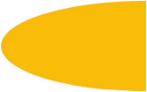

### 1.自适应的椭圆
#### 自适应的椭圆

	
	border-radius: 50%;

#### 上半椭圆

	border-radius: 50% 50% 0 0 /100% 100% 0 0;

#### 下半椭圆

	
	border-radius: 100% 0 0 100% /50%;

#### 四分之一圆

	border-radius: 100% 0 0 0;

----------

### 2.平行四边形

#### 嵌套元素方案

	<a href="#yolo" class="button">
	
Click me

	</a>

	.button { transform: skewX(-45deg); }
	.button > div { transform: skewX(45deg); }

#### 伪元素方案
	.btn1{
		position: relative;
	}
	.btn1:before{
		content: '';
		position: absolute;
		z-index: -1;
		top: 0; right: 0; bottom: 0; left: 0;
		transform: skew(45deg);
		background: #58a;
	}

----------

### 3.菱形图片

----------

### 4.切角效果

----------

### 5.梯形标签页

----------

### 6.简单的拼图

