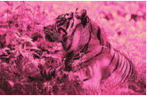
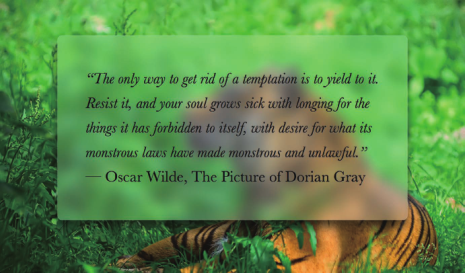

### 1.单侧投影
#### 单侧投影

	box-shadow: 0 5px 4px -4px black;

#### 邻边投影

	box-shadow: 3px 3px 6px -3px black;

#### 双侧投影

	
	box-shadow: 5px 0 5px -5px #000,
				-5px 0 5px -5px #000;

----------

### 2.不规则投影
解决方案：滤镜效果

	filter: drop-shadow(2px 2px 10px rgba(0,0,0,.5));

----------

### 3.染色效果

#### 基于滤镜的方案

	img{
		transition: 0.5s filter;
		filter: sepia(1) saturate(4) hue-rotate(295deg);
	}
	img:hover{
		filter: none;
	}

#### 基于混合模式的方案
一、
	
	

	
	
二、（这个方法我没试成功）

	

	
	.tinted-image {
		width: 640px; height: 440px;
		background-size: cover;
		background-color: hsl(335, 100%, 50%);
		background-blend-mode: luminosity;
		transition: .5s background-color;
	}
	.tinted-image:hover {
		background-color: transparent;
	}

----------

### 4.毛玻璃效果

	body, main::before {
		background: url("tiger.jpg") 0 / cover fixed;
	}
	main {
		position: relative;
		background: hsla(0,0%,100%,.3);
		overflow: hidden;
	}
	main::before {
		content: '';
		position: absolute;
		top: 0; right: 0; bottom: 0; left: 0;
		filter: blur(20px);
		margin: -30px;
	}

----------

### 5.折角效果
