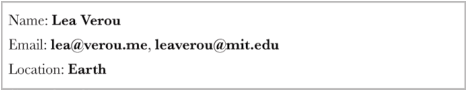
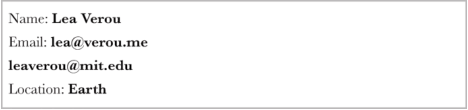
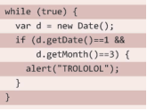
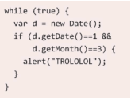
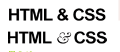
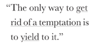
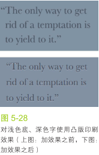
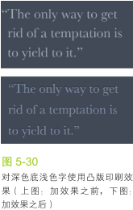
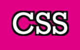
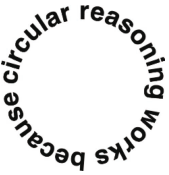

### 1.连字符断行
	
	hyphens: auto;

CSS3引入了一个新的属性 hyphens，它接受三个值none 、 manual 和 auto。manual和auto我没看出来有什么区别，而且谷歌浏览器不支持auto。

----------

### 2.插入换行

	<dl>
		<dt>Name:</dt>
		<dd>Lea Verou</dd>
		<dt>Email:</dt>
		<dd>lea@verou.me</dd>
		<dd>leaverou@mit.edu</dd>
		<dt>Location:</dt>
		<dd>Earth</dd>
	</dl>

	

- 1.请出老套的` `不合适
- 2.设置dt,dd元素的样式，display:inline;有个\000A简化为\A Unicode字符专门代表换行符`dd:after{content: '\A';}`
- 3.这样看起来不凑效，需要添加样式`white-space: pre;`，成功
- 4.如果有两个dd，就会这样
- 5.dd + dt用这个代替dt
- 6.两个dd中间加个逗号，dd + dd::before {content: ','; font-weight:normal;}
- 7.逗号中间有空格，利用负外边距margi-left: -0.25em;

----------

### 3.文本行的斑马条纹

	padding: 0.5em;
	height: 150em;
	line-height: 1.5em;
	background: beige;
	background-image: linear-gradient(rgba(0,0,0,0.2) 50%, transparent 0);
	background-size: auto 3em;
	background-origin: content-box;
	font-size: 12px;

需要加上字体的大小，而且必须是偶数，否则会有错位

----------

### 4.调整tab的宽度

	
	pre {
		tab-size: 2;
	}

----------

### 5.连字

	font-variant-ligatures: common-ligatures 
							discretionary-ligatures 
							historical-ligatures;

----------

### 6.华丽的&符号
> 这个用的比较少，利用@font-face引入签入字体，然后利用unicode-range声明我们想用这几款字体来显示哪些字符。
> 如果想自定义样式，比如增大字体，改变透明度等等，我们只能修改HTML结构；如果想美化数字，符号，标点这个方法堪称完美。

	
	@font-face {
		font-family: Ampersand;
		src: local('Baskerville-Italic'),
		local('GoudyOldStyleT-Italic'),
		local('Palatino-Italic'),
		local('BookAntiqua-Italic');
		unicode-range: U+26;
	}
	h1 {
		font-family: Ampersand, Helvetica, sans-serif;
	}

----------

### 7.自定义下划线
> 这个只能是一行文字，多行文字除了第一行，其他行没有效果

	background: linear-gradient(gray, gray) no-repeat;
	background-size: 100% 1px;
	background-position: 0 1.15em;
	text-shadow: .05em 0 white, -.05em 0 white;

----------

### 8.现实中的文字效果
#### 凸版印刷效果
> 当文字比背景的颜色浅时，给文字的底部加投影
> 当文字比背景的颜色深时，给文字的顶部加投影

 

	background: hsl(210, 13%, 60%);
	color: hsl(210, 13%, 30%);
	text-shadow: 0 1px 1px hsla(1, 0%, 100%, 0.8);

 

	background: hsl(210, 13%, 30%);
	color: hsl(210, 13%, 60%);
	text-shadow: 0 -1px 1px black;

#### 空心字效果

	
	background: deeppink;
	color: white;
	text-shadow: 3px 3px black, -3px -3px black,
				 3px -3px black, -3px 3px black; 

#### 文字外发光效果

	background: #203;
	color: #ffc;
	text-shadow: 0 0 0.1em, 0 0 0.3em;

#### 文字凸起效果

	background: #58a;
	color: white;
	text-shadow: 0 1px hsl(0, 0%, 85%),
				 0 2px hsl(0, 0%, 80%),
				 0 3px hsl(0, 0%, 75%),
				 0 4px hsl(0, 0%, 70%),
				 0 5px hsl(0, 0%, 65%),
				 0 5px 10px black;

----------

### 9.环形文字

	

		<svg viewBox="0 0 100 100">
			<path d="M 0,50 a 50,50 0 1,1 0,1 z" id="circle" />
			<text>
				<textPath xlink:href="#circle">
					circluar resaoning works because
				</textPath>
			</text>
		</svg>
	

	
	

