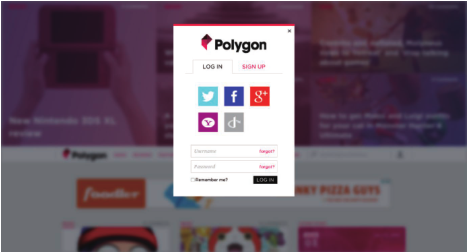

### 1.选用合适的鼠标光标

#### 提示禁用状态

	:disabled,[disabled],[aria-disabled="true"]{
		cursor: not-allowed;
	}

#### 隐藏鼠标光标
	
	css2.1中，用一张1X1的透明GIF图片
	video{
		cursor: url('transparent.gif');
	}
	
	css3中，用新的特性
	video{
		cursor: url('transparent.gif');
		cursor: none;
	}

----------

### 2.扩大可点击区域

	border: 10px solid transparent;
	background-clip: padding-box;
	box-shadow: 0 0 0 1px rgba(0,0,0.3) inset;

不过这个解决方案在其他方面不够完美:边框会影响布局，而且在某些场景下我们可能根本无法利用边框。然而，我们可以利用另外一个特性来实现：伪元素同样可以代表其宿主元素来影响鼠标交互。
	
	button{
		position: relative;
	}
	button{
		content: '';
		position: absolute;
		top: -10px; right: -10px;
		bottom: -10px; left: -10px;
	}

----------

### 3.自定义复选框
#### 复选框和单选框

> 不能使用display:none;因为那样会把它从键盘tab键切换焦点的队列中完全删除。我们改用另外一个方法来达到目的。position:absolute;clip: rect(0,0,0,0)

	input[type="checkbox"]{
		position: absolute;
		clip: rect(0,0,0,0);
	}
	input[type="checkbox"]+label:before{
		content: '\a0';
		display: inline-block;
		vertical-align: 0.1em;
		width: .8em;
		height: .8em;
		margin-right: .2em;
		border-radius: .2em;
		background: silver;
		text-indent: .15em;
		line-height: .65;
	}
	input[type="checkbox"]:checked+label:before{
		content: '\2713';
		background: yellowgreen;
	}
	input[type="checkbox"]:focus+label:before{
		box-shadow: 0 0 .1em .1em #58a;
	}
	input[type="checkbox"]:disabled+label:before{
		background: gray;
		box-shadow: none;
		color: #555;
	}

#### 开关式按钮

	
	input[type="checkbox"]{
		position: absolute;
		clip: rect(0,0,0,0);
	}
	input[type="checkbox"]+label{
		display: inline-block;
		padding: .3em .5em;

		background: #ccc;
		background-image: linear-gradient(#ddd, #bbb);
		border: 1px solid rgba(0,0,0,0.2);
		border-radius: .3em;
		box-shadow: 0 1px white inset;
		text-align: center;
		text-shadow: 0 1px 1px white;
	}
	input[type="checkbox"]:checked+label,
	input[type="checkbox"]:active+label{
		box-shadow: 0.05em .1em .2em rgba(0,0,0,0.6) inset;
		border-color: rgba(0,0,0,0.3);
		background: #bbb;
	}

----------

### 4.通过阴影来弱化背景

#### 伪元素方案
> 缺点：他可能出现在这个元素之后，但也可能出现在这个元素的父元素或祖先元素之后；伪元素无法绑定独立的javascript事件处理函数。

	.target:before{
		position: fixed;
		top: 0;
		right: 0;
		bottom: 0;
		left: 0;
		z-index: 1;
		background: rgba(0,0,0,.8);
	}
	
#### box-shadow方案
> 缺点：	1.由于遮罩层的尺寸与视口相关，当我们滚动页面时，遮罩层的边缘就露出来了，除非给它加上position:fixed;2.不能防止用户的鼠标与页面的其他部分发生交互。

	box-shadow: 0 0 0 50vmax rgba(0,0,0,.8);

#### backdrop方案
> 缺点：浏览器对它的支持还极为有限

	dialog::backdrop {
		background: rgba(0, 0, 0, .8);
	}

----------

### 5.通过模糊来弱化背景

	<main>Bacon Ipsum dolor sit amet...</main>
	<dialog>O HAI, I'm a dialog. Click on me to dismiss.</dialog>

	main.de-emphasized {
		filter: blur(3px) contrast(.8) brightness(.8);
	}

----------

### 6.滚动提示

----------

### 7.交互式的图片对比控件

