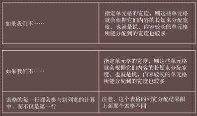

### 1.自适应内部元素

	figure {
		max-width: 300px;
		max-width: min-content;
		margin: auto;
	}
	figure > img { 
		max-width: inherit; 
	}

----------

### 2.精确控制列表列宽
	

	table {
		table-layout: fixed;
		width: 100%;
	}

----------

### 3.根据兄弟元素的数量来设

----------

### 4.满幅的背景，定宽的内容

----------

### 5.垂直居中

----------

### 6.紧贴底部的页脚

