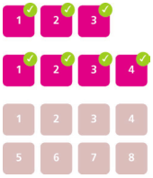

### 1.自适应内部元素

	figure {
		max-width: 300px;
		max-width: min-content;
		margin: auto;
	}
	figure > img { 
		max-width: inherit; 
	}

----------

### 2.精确控制列表列宽
	

	table {
		table-layout: fixed;
		width: 100%;
	}

----------

### 3.根据兄弟元素的数量来设置样式
	
	
	li:first-child:nth-last-child(4),
	li:first-child:nth-last-child(4) ~ li {
		/* 当列表正好包含四项时，命中所有列表项 */
	}

#### 根据兄弟元素的数量范围来匹配元素

	li:first-child:nth-last-child(n+4),
	li:first-child:nth-last-child(n+4) ~ li {
		/* 当列表至少包含四项时，命中所有列表项 */
	}

	
	li:first-child:nth-last-child(-n+4),
	li:first-child:nth-last-child(-n+4) ~ li {
		/* 当列表最多包含四项时，命中所有列表项 */
	}

 

	li:first-child:nth-last-child(n+2):nth-last-child(-n+6),
	li:first-child:nth-last-child(n+2):nth-last-child(-n+6) ~ li {
		/* 当列表包含2～6项时，命中所有列表项 */
	}

----------

### 4.满幅的背景，定宽的内容

	
	footer {
		padding: 1em;
		padding: 1em calc(50% - 450px);
		background: #333;
	}

----------

### 5.垂直居中
#### 基于绝对定位的解决方案

> 1.有时我们不能选用绝对定位，因为他对整个布局的影响太过强烈
> 2.如果需要居中的元素已经在高度上超过了视口，那它的顶部会被视口切掉
> 3.在某些浏览器中，这个方法可能会导致元素的显示有一些模糊，因为元素可能被放置在半个像素上。这个问题可以用transform-style: preserve-3d来修复

	main {
		position: absolute;
		top: 50%;
		left: 50%;
		margin-top: -3em;
		margin-left: -9em;
		width: 18em;
		height: 6em;
	}

 
	
	main {
		position: absolute;
		top: 50%;
		left: 50%;
		transform: translate(-50%, -50%);
	}

#### 基于视口单位的解决方案

	main {
		width: 18em;
		padding: 1em 1.5em;
		margin: 50% auto 0;
		transform: translateY(-50%);
	}

 

	main {
		width: 18em;
		padding: 1em 1.5em;
		margin: 50vh auto 0;
		transform: translateY(-50%);
	}

#### 基于 Flexbox 的解决方案

	body {
		display: flex;
		min-height: 100vh;
		margin: 0;
	}
	main {
		margin: auto;
	}

----------

### 6.紧贴底部的页脚

	body{
		display: flex;
		flex-flow: column;
		min-height: 100vh;
	}
	main{
		flex: 1;
	}

