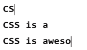
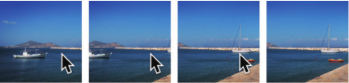

#### 1.缓动效果
> 主要用到cubic-bezier

#### 2.逐帧动画

	@keyframes loader {
		to { background-position: -800px 0; }
	}
	.loader {
		width: 100px; height: 100px;
		background: url(img/loader.png) 0 0;
		animation: loader 1s infinite steps(8);
		
		/* 把文本隐藏起来 */
		text-indent: 200%;
		white-space: nowrap;
		overflow: hidden;
	}

#### 3.闪烁效果

#### 4.打字效果

> 1.它不适用于多行文本
> 2.汉字好像也不行
> 3.英文字母好像要设置字体是宋体比较合适

	<h1>CSS is awesome!</h1>
	
	

#### 5.状态平滑的动画

> 主要用到animation-play-state这个属性

	

	
	

#### 6.沿环形路径平移的动画
