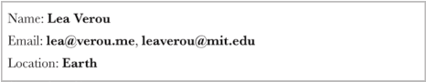
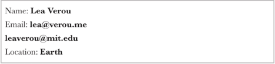
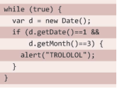
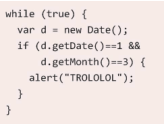

### 1.连字符断行
	
	hyphens: auto;

CSS3引入了一个新的属性 hyphens，它接受三个值none 、 manual 和 auto。manual和auto我没看出来有什么区别，而且谷歌浏览器不支持auto。

----------

### 2.插入换行

	<dl>
		<dt>Name:</dt>
		<dd>Lea Verou</dd>
		<dt>Email:</dt>
		<dd>lea@verou.me</dd>
		<dd>leaverou@mit.edu</dd>
		<dt>Location:</dt>
		<dd>Earth</dd>
	</dl>

	

- 1.请出老套的` `不合适
- 2.设置dt,dd元素的样式，display:inline;有个\000A简化为\A Unicode字符专门代表换行符`dd:after{content: '\A';}`
- 3.这样看起来不凑效，需要添加样式`white-space: pre;`，成功
- 4.如果有两个dd，就会这样
- 5.dd + dt用这个代替dt
- 6.两个dd中间加个逗号，dd + dd::before {content: ','; font-weight:normal;}
- 7.逗号中间有空格，利用负外边距margi-left: -0.25em;

----------

### 3.文本行的斑马条纹

	padding: 0.5em;
	height: 150em;
	line-height: 1.5em;
	background: beige;
	background-image: linear-gradient(rgba(0,0,0,0.2) 50%, transparent 0);
	background-size: auto 3em;
	background-origin: content-box;
	font-size: 12px;

需要加上字体的大小，而且必须是偶数，否则会有错位

----------

### 4.调整tab的宽度

	
	pre {
		tab-size: 2;
	}

----------

### 5.连字

	font-variant-ligatures: common-ligatures 
							discretionary-ligatures 
							historical-ligatures;

----------

### 6.华丽的&符号

----------

### 7.自定义下划线

----------

### 8.现实中的文字效果

----------

### 9.环形文字

